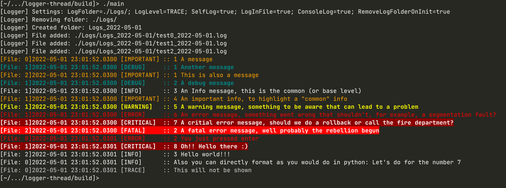

# Logger thread C++

This is a logger thread to log the program event. It uses my [thread wrapper](https://github.com/eHonnef/thread-cpp).

It can manage multiple files, also it bufferize the strings before writting to file to minimize the IO load.

## Usage

Very simple, just import it and be happy :)

You can tweak some stuff in the [LoggerDaemon file](include/LoggerThread/LoggerDaemon.cc):

- `c_nBufferSize`: Set the buffer size, [it seems like common agreement is 4096 bytes](https://stackoverflow.com/questions/1862982/c-sharp-filestream-optimal-buffer-size-for-writing-large-files);
- `c_nMaxIterations`: Set the max iterations without writting to file before writting to file, default is 50, so, if there is 50 iterations without writting to file, then it'll force write the buffer to file;

Then you can add a log file using the `AddLogFile` function, it'll register the file and return the file index inside the thread. So, when you are writting a log you call the `Write` functions with this index to indicate the file to be written.

**Important:**

- Before calling `Start` you need to call `Init` then add the files with `AddLogFile` and finally call `Start`.
- The `Stop` function will wait for the thread to write the remaining queue into file, also the buffer.
- You can customize some functionalities using the `Settings` function, as done in the [main](app/main.cpp) file.

Checkout [main](app/main.cpp) for an usage example.

We format the logs like `Date Time.Ms [Level] :: Message\n`. Below is how the log looks like with all [log levels](include/LoggerThread/LoggerDaemon.cc#L107) shown:

```log
2022-03-24 23:35:01.0090 [TRACE]     :: Tracing message
2022-03-24 23:35:01.0090 [DEBUG]     :: A debug message
2022-03-24 23:35:01.0090 [INFO]      :: An Info message, this is the common (or base level)
2022-03-24 23:35:01.0090 [IMPORTANT] :: An important info, to highlight a "common" info
2022-03-24 23:35:01.0090 [WARNING]   :: A warning message, something to be aware that can lead to a problem
2022-03-24 23:35:01.0090 [ERROR]     :: An error message, something went wrong that shouldn't, for example, an access violation
2022-03-24 23:35:01.0090 [CRITICAL]  :: A critial error message, should we do a rollback or call the fire department?
2022-05-01 23:01:52.0300 [FATAL]     :: A fatal error message, well, probably the rebellion has begun
```

Also, you can format the messages in the python way, thanks to [fmtlib](https://github.com/fmtlib/fmt):

```c++
WriteInfo("A number {}, a string {}, a float {}", 1, "string", "1.3");
```

To write a message to a log, just call one of the `Write...` functions:

- WriteTrace
- WriteDebug
- WriteInfo
- WriteImportant
- WriteWarning
- WriteError
- WriteCritical
- WriteFatal

If you print to the console, there are some colors for the terminal:



## Include in my project

Using CMake's `FetchContent`:

```cmake
FetchContent_Declare(LoggerThread
  GIT_REPOSITORY "https://github.com/eHonnef/logger-thread"
  GIT_TAG "master"
  GIT_SHALLOW TRUE
)
FetchContent_MakeAvailable(LoggerThread)
target_link_libraries(${PROJECT_NAME} PUBLIC LoggerThread)
```

And then you can include the header:

```cpp
#include <LoggerThread/LoggerDaemon.cc>
```

If you want to import without using the cmake function, you need to also copy the [Daemon](https://github.com/eHonnef/thread-cpp/blob/master/include/ThreadWrapper/Daemon.cc) file from my other project. I'll work in a better way to include this way, for now the better way is using the cmake way.
